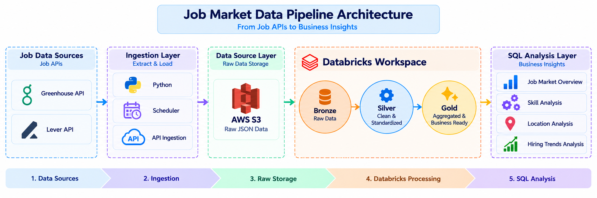
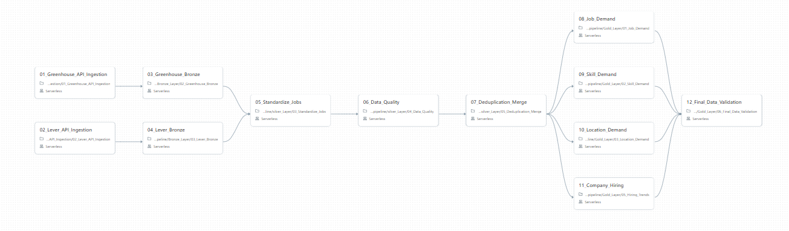

# Job Market Analysis Pipeline

An end-to-end **Data Engineering project** that collects job postings from Greenhouse and Lever APIs, processes them through a Databricks Lakehouse, and turns them into SQL-based hiring insights.

---

## Business Problem

Job data is spread across different hiring platforms with different schemas and formats. This makes it difficult to get a consistent view of:

- Where companies are hiring
- Which roles and skills are in demand
- Which locations have the most opportunities
- How hiring changes over time

---

## Approach

We built a pipeline to:

1. **Extract** job data from Greenhouse and Lever APIs using Python.
2. **Store** the raw JSON responses in **AWS S3**.
3. Process the data in **Databricks** using the Bronze → Silver → Gold architecture.
4. Apply **data cleaning, standardization, quality checks and deduplication**.
5. Create business-ready Gold tables for job, skill, location and hiring-trend analysis.
6. Use **SQL** to answer business questions and generate hiring insights.

---

## Architecture

---

## Scheduled Pipeline

The pipeline is scheduled to run automatically using **Databricks Jobs**.

---

## Key Results

- Processed **2,221 job postings** from Greenhouse and Lever.
- Standardized different API schemas into a common job structure.
- Implemented **data-quality validation and quarantine handling**.
- Applied deterministic deduplication with **0 duplicate records remaining**.
- Built Gold datasets for **job demand, skill demand, location demand and hiring trends**.
- Performed **SQL-based business analysis** across the four analysis areas.

---

## Tech Stack

**Python · REST APIs · AWS S3 · Databricks · PySpark · SQL · Delta Lake**

---

